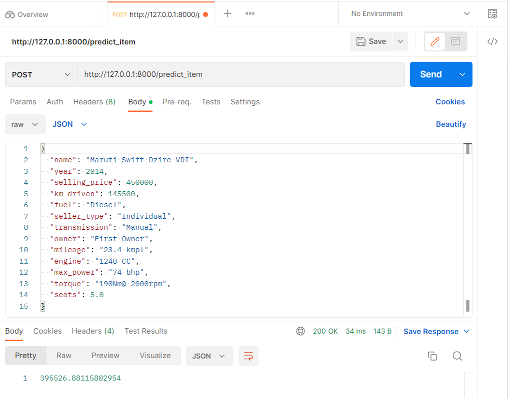
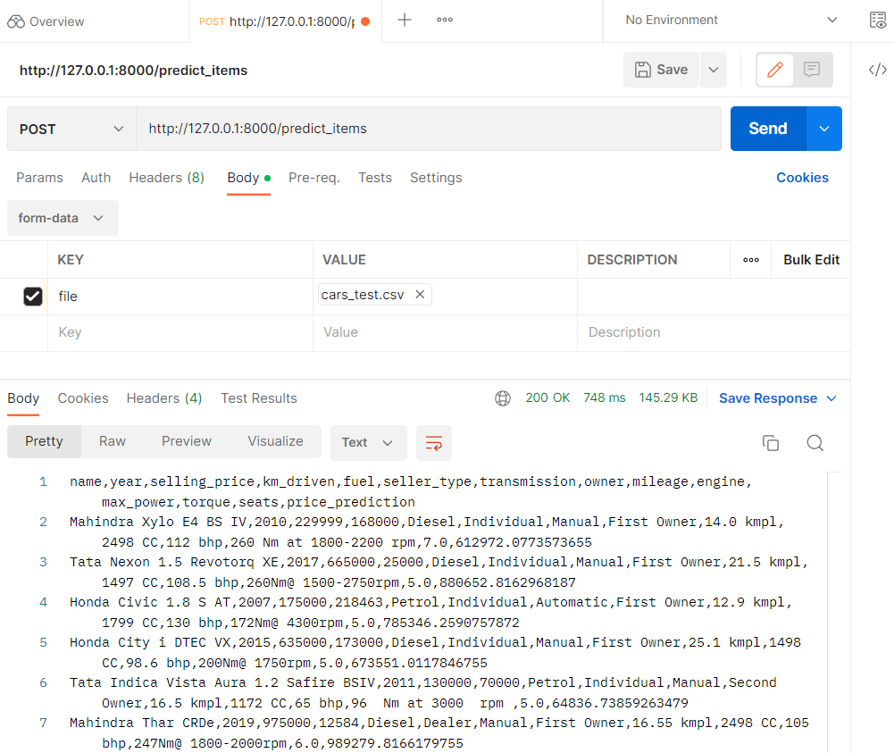
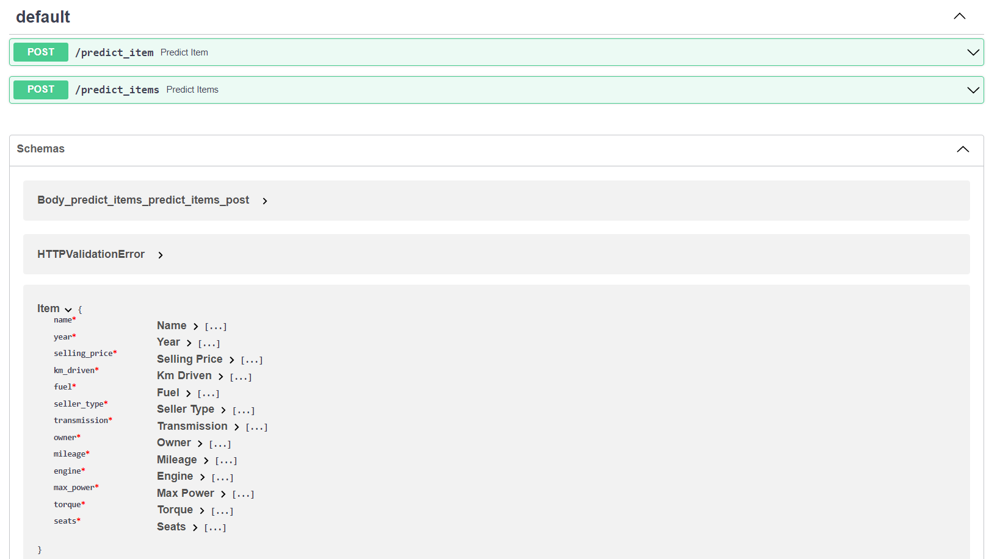

# Домашнее задание 1

В ходе работы была обучена модель регрессии для предсказания стоимости автомобилей, а также реализован веб-сервис для применения построенной модели. 

Перед построением модели был проведён базовый разведовательный анализ данных, которые были предоставлены для обучения модели. Исходный датасет состоял из 7 тысяч строк, в ходе предобработки данных перед обучением моделей он сократился до 5 840 строк. Данные характеризуются наличием выбросов и смещен влево, большим числом повторов, большинство признаков имеют слабую корреляцию между собой.

В ходе обучения моделей не удалось получить высокий показатель $R^2$, вероятно, из-за наличия выбросов и других особенностей данных. Классическая модель линейной регрессии, обученная только на вещественных признаках датасета, дала скор в 0.59 и достаточно высокую MSE. Lasso-регрессия дала прирост $R^2$ лишь на 0.003, как и ElasticNet. 

Наилучшим образом показала себя модель Ridge-регрессии с предварительным One-Hot кодированием категориальных признаков - несмотря на то, что она не сократила MSE радикально, она дала больший прирост в $R^2$ - до 0.62. В то же время бизнесовая метрика - доля предсказанных цен, отличающихся от реальных не более чем на 10%, оказалась равна только 25%.

Для реализации сервиса на FastAPI потребовалось сохранить параметры модели Ridge-регрессии, модели для нормализации значений данных, а также названия колонок данных, на которых училась модель. В сервисе предобработка данных вынесена в отдельную функцию, т.к. для обоих вариантов передаваемых данных она практически не отличается (исключения составляют добавление категориальных фич и заполнение пропусков).

Было замечено, что предсказания для 1 элемента и для датасета в некоторых случаях отличаются, но я так и не смогла понять наверняка, почему - возможно, какие-то из категориальных фич в модели воспринимаются по-особенному, т.к. при их кодировании во избежании мультиколлинеарности выкидывались первые столбцы. Однако сервис работает корректно и выдаёт результат. Также я не очень поняла, зачем нужен был класс Items и по итогу его не использовала, просто считывая csv.

